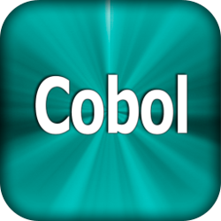

# ACTIVITAT 2: PRÀCTICA AMB LLENGUATGES
Ara que ja coneixeu uns quants llenguatges de programació el que farem serà
crear un programa d’exemple.  
El programa simplement ha de generar un número aleatori de l’1 al 6 i s’anomenarà “d6”, simula el llançament d’un dau de 6 cares.

Escolliu 3 llenguatges de programació, un de compilat, un d’interpretat i un de MV.

**Per al llenguatge compilat:**  
- Utilitzant la línia de comandes, sense utilitzar un IDE de desenvolupament escriureu el programa en un fitxer de text que sigui el codi font, el codi font l’adjunteu dins el document.  
- Identifiqueu el compilador real que utilitzeu (nom de l’executable) i la comanda per utilitzar-lo per passar de codi font a codi objecte.  
- Descriviu com passar de codi font a codi objecte.  
- Mostreu les extensions dels fitxers de codi font i codi objecte.  
- Descriviu com passar de codi objecte a executable.  
- Expliqueu els avantatges d’utilitzar un llenguatge compilat i els punts febles.  
- Busqueu 3 IDEs de desenvolupament pel llenguatge.  

**Per al llenguatge interpretat:**
- Utilitzant la línia de comandes, sense utilitzar un IDE de desenvolupament escriureu el programa en un fitxer de text que sigui el codi font, el codi font l’adjunteu dins el document.  
- Identifiqueu l'intèrpret del llenguatge (l’executable).
- Descriviu com funciona l’intèrpret.
- Mostreu les extensions dels fitxers de codi font.
- Expliqueu els avantatges d’utilitzar un llenguatge interpretat i els punts febles.
- Busqueu 3 IDEs de desenvolupament pel llenguatge. 

**Per al llenguatge de MV:**
- Utilitzant la línia de comandes, sense utilitzar un IDE de desenvolupament escriureu el programa en un fitxer de text que sigui el codi font, el codi font l’adjunteu dins el document.  
- Identifiqueu el compilador real (nom d’executable) que utilitzeu i la comanda per utilitzar-lo per passar de codi font a ByteCode.  
- Descriviu com passar de codi font a ByteCode.
- Mostreu les extensions dels fitxers de codi font i ByteCode.
- Descriviu com executar el programa.
- Expliqueu els avantatges d’utilitzar un llenguatge de MV i els punts febles.
- Busqueu 3 IDEs de desenvolupament pel llenguatge. 

##  Python

Algunes de les moltes avantatges que ens ofereix Python son la seva gran compatibilitat amb tots els sistemes operatius, és un llenguatge relativament fàcil d'aprendre ja que la seva sintaxis no és molt complicada i ens permet crear programes amb poques línies de codi. A més a més Python té una comunitat molt gran ja que és de codi obert. Alguna de les desavantatges que pot presentar Python es que pot arribar a ser un poc lent i tenir un alt consum de memòria.  
```
import random
print(random. randrange(6))
```
Alguns dels IDEs que podem usar per a progrmar amb Pyhton són PyDev, PyCharm o Spyder.  
<p align="center">
    
</p>

##  Cobol

```
identification division.
program-id. d6.

environment division.
configuration section.

data division.
working-storage section.
01 hora.

    05 hh pic 6.
    05 hm pic 6.
    05 hs pic 6.
    05 hx pic 6.

procedure division.
    accept hora from time

    display hx
    stop ' '
    goback.
end program d6.
```

Per programar amb Cobol podem usar OpenCobol IDE, Notepad++ o isCobol.  
<p align="center">
    
</p>

##  Java
Algunes de les principals avantatges que ens ofereix Java són la seva versatilitat i la seva capacitat multiplataforma, es pot usar per crear tot tipus d’aplicacions en qualsevol sistema operatiu. Les principals desavantatges del llenguatge són la seva sintaxis ja que és més complexa comparada amb llenguatges com Python, a més el fet d’usar la maquina virtual JVM fa que el llenguatge sigui totalment dependent d’aquesta.  

```
import java.util.Random;

public class Dado {
    public static void main(String[] args) {


        int numAleatori = 1;
        Random rd = new Random();
        numAleatori = rd.nextInt(7);
        System.out.println(numAleatori);
    }
}
```
Alguns dels IDEs més usats per programar amb Java són IntelliJ, NetBeans o Eclipse.
<p align="center">
    
</p>
