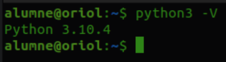
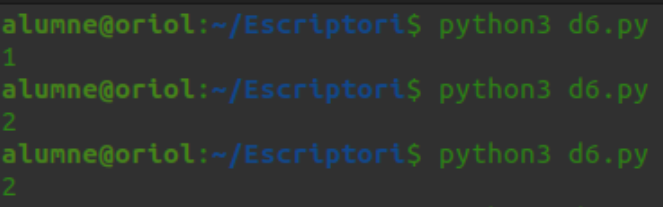
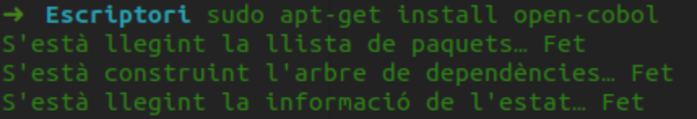
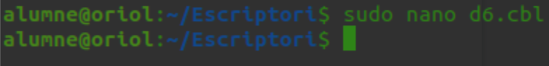
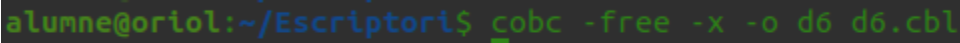
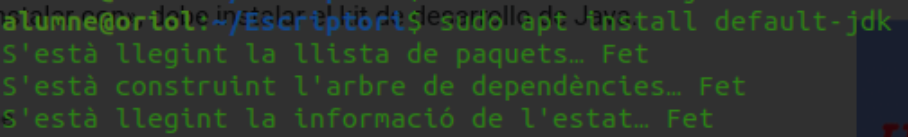
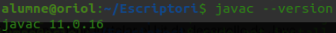
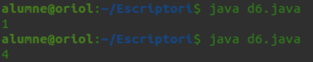
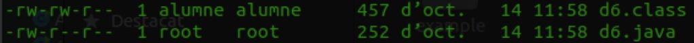

# ACTIVITAT 2: PRÀCTICA AMB LLENGUATGES
Ara que ja coneixeu uns quants llenguatges de programació el que farem serà
crear un programa d’exemple.  
El programa simplement ha de generar un número aleatori de l’1 al 6 i s’anomenarà “d6”, simula el llançament d’un dau de 6 cares.

Escolliu 3 llenguatges de programació, un de compilat, un d’interpretat i un de MV.

**Per al llenguatge compilat:**  
- Utilitzant la línia de comandes, sense utilitzar un IDE de desenvolupament escriureu el programa en un fitxer de text que sigui el codi font, el codi font l’adjunteu dins el document.  
- Identifiqueu el compilador real que utilitzeu (nom de l’executable) i la comanda per utilitzar-lo per passar de codi font a codi objecte.  
- Descriviu com passar de codi font a codi objecte.  
- Mostreu les extensions dels fitxers de codi font i codi objecte.  
- Descriviu com passar de codi objecte a executable.  
- Expliqueu els avantatges d’utilitzar un llenguatge compilat i els punts febles.  
- Busqueu 3 IDEs de desenvolupament pel llenguatge.  

**Per al llenguatge interpretat:**
- Utilitzant la línia de comandes, sense utilitzar un IDE de desenvolupament escriureu el programa en un fitxer de text que sigui el codi font, el codi font l’adjunteu dins el document.  
- Identifiqueu l'intèrpret del llenguatge (l’executable).
- Descriviu com funciona l’intèrpret.
- Mostreu les extensions dels fitxers de codi font.
- Expliqueu els avantatges d’utilitzar un llenguatge interpretat i els punts febles.
- Busqueu 3 IDEs de desenvolupament pel llenguatge. 

**Per al llenguatge de MV:**
- Utilitzant la línia de comandes, sense utilitzar un IDE de desenvolupament escriureu el programa en un fitxer de text que sigui el codi font, el codi font l’adjunteu dins el document.  
- Identifiqueu el compilador real (nom d’executable) que utilitzeu i la comanda per utilitzar-lo per passar de codi font a ByteCode.  
- Descriviu com passar de codi font a ByteCode.
- Mostreu les extensions dels fitxers de codi font i ByteCode.
- Descriviu com executar el programa.
- Expliqueu els avantatges d’utilitzar un llenguatge de MV i els punts febles.
- Busqueu 3 IDEs de desenvolupament pel llenguatge. 

## COMPILAT, INTERPRETAT O MV?  

Els llenguatges compilats es converteixen directament a codi màquina per ser executat pel processador. Aquests llenguatges solen tenir una execució més ràpida i permeten al programador controlar la gestió de memòria i de processador.   

Els llenguatges interpretats depenen de l’intèrpret que executa el codi instrucció per instrucció. Solen ser més lents que els llenguatges compilats, una de les principals avantatges és la seva portabilitat, a diferència dels llenguatges compilats no cal adaptar el codi si canvies el teu programa de plataforma.    

Els llenguatges executats en màquina virtual ofereixen una total portabilitat sempre i quan la plataforma on volem executar el nostre programa tingui implementada la màquina virtual. Això fa que el nostre codi font sigui sempre el mateix però som totalment dependents de la màquina virtual.  

<p align="center">
    
</p>  

##  Python

Python ja ve instal·lat amb linux així que només hem tingut que comprovar la versió.  
<p align="center">
    
</p>  

**Joc dau:**
```
import random
print(random. randrange(6))
```

Per a executar-lo tenim que ficar python3 i el nom de l'arxiu que te que acabar amb l'extensió .py.  
<p align="center">
    
</p>  
<p align="center">
    
</p>  

Per al llenguatge interpret no s’utilitza el codi objecte, s’executa directament utilitzant un programa que es diu intèrpret que ho tradueix i executa amb un ordre específic.  
Algunes de les moltes avantatges que ens ofereix Python son la seva gran compatibilitat amb tots els sistemes operatius, és un llenguatge relativament fàcil d'aprendre ja que la seva sintaxis no és molt complicada i ens permet crear programes amb poques línies de codi. A més a més Python té una comunitat molt gran ja que és de codi obert. Alguna de les desavantatges que pot presentar Python es que pot arribar a ser un poc lent i tenir un alt consum de memòria.  

Alguns dels IDEs que podem usar per a progrmar amb Pyhton són PyDev, PyCharm o Spyder.  
<p align="center">
    
</p>

##  Cobol

Primer tenim que instalar el Cobol.  
<p align="center">
    
</p>  
Desprès tenim que crear un document amb l'extensió .cbl.  

<p align="center">
    
</p>  

**Joc dau:**
```
identification division.
program-id. d6.

environment division.
configuration section.

data division.
working-storage section.
01 hora.

    05 hh pic 6.
    05 hm pic 6.
    05 hs pic 6.
    05 hx pic 6.

procedure division.
    accept hora from time

    display hx
    stop ' '
    goback.
end program d6.
```

Quan ja tenim el programa creat, tenim que compilar-lo.  

<p align="center">
    
</p> 
Un cop compilat l’hem executat com si fos un script al terminal i ens ha donat un número aleatori.  
<p align="center">
    
</p>  

Quan un codi font es troba guardat en una biblioteca externa es fa servir un programa que es diu enllaçador per a inserir al codi objecte les funcions necessàries per a montar el arxiu executable. Per passar de codi font a codi objecte es fa servir un programa que es diu compilador perque el codi font no es identificable per a la màquina, el compilador ho tradueix a binari creant un codi objecte.  

Cobol es un llenguatge senzill, ràpid i fiable, per això s’utilitza en el món de la banca, l'optimització també és un dels seus punts ja que s’ha anat perfeccionant al llarg dels anys, a més a més també es un llenguatge amb una gran portabilitat. Un dels principals punts negatius és la seva comunitat ja que no es tan gran com la de Python o Java, això fa que la documentació sigui escassa.  

Per programar amb Cobol podem usar OpenCobol IDE, Notepad++ o isCobol.  
<p align="center">
    
</p>

##  Java

Instal·lem Java i comprovem la versió.  
<p align="center">
    
</p> 
<p align="center">
    
</p> 

**Joc dau:**
```
import java.util.Random;

public class Dado {
    public static void main(String[] args) {


        int numAleatori = 1;
        Random rd = new Random();
        numAleatori = rd.nextInt(7);
        System.out.println(numAleatori);
    }
}
```  

Executem el programa.  
<p align="center">
    
</p> 

El fitxer ByteCode té l'extensió .class i el del codi font .java.  
<p align="center">
    
</p>  

La Màquina Virtual compila amb el compilador JIT (Just-in-time), que és un sistema que tradueix el bytecode a mesura que fa falta però hi ha una cache per a no tornar a traduir el codi innecessàriament.  
Algunes de les principals avantatges que ens ofereix Java són la seva versatilitat i la seva capacitat multiplataforma, es pot usar per crear tot tipus d’aplicacions en qualsevol sistema operatiu. Les principals desavantatges del llenguatge són la seva sintaxis ja que és més complexa comparada amb llenguatges com Python, a més el fet d’usar la maquina virtual JVM fa que el llenguatge sigui totalment dependent d’aquesta.  

Alguns dels IDEs més usats per programar amb Java són IntelliJ, NetBeans o Eclipse.
<p align="center">
    
</p>
